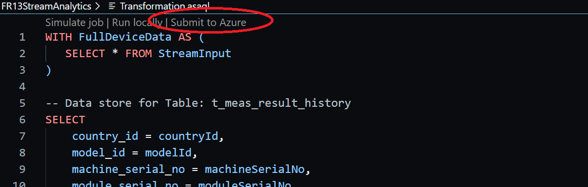

# Fr13StreamAnalytics

## 概要

本リポジトリは Azure Stream Analytics のローカル開発環境をまとめたものである。
VSCode上での開発を前提とし、主に以下のもので構成される。

- Inputs
  - Azure Stream Analyticsの[入力]の項目に該当
  - 入力ソースに変更が無ければ特に変更は不要
- Transformation.asaql
  - Azure Stream Analyticsの[クエリ]の項目に該当
  - ストリームデータと保存先(後述するOutputs)の対応関係を管理する
  - SQLクエリと同等の記法(格納前にデータを加工することも可能)
- Outputs
  - Azure Stream Analyticsの[出力]の項目に該当
  - ここで設定されたものがクエリの出力先として使用可能となる

## VSCodeへの導入

1. 本開発環境に必要な以下のものをインストールする。

    - Azure Stream Analytics(VSCode拡張)
    - ASP.NET Core 6.0 Runtime

2. VScodeで本リポジトリのフォルダ (Fr13StreamAnalytics) を開く

## クエリの編集

1. Transformation.asaql を適宜編集する
2. 編集画面上部に位置する [Submit to azure] をクリックしてAzureにアップロードする

エラーが出る場合があるが、アップロードは完了できている　<＝何回か繰り返すとエラーが発生しなくなる

## 出力先の追加

1. エディタ上で他のOutputsファイルを参考にして複製を作成し、適切なファイル名で保存する
2. 以下のコードにおいて、"Name"プロパティを編集する。このプロパティが出力エイリアス名に相当する。

    ```json
    {
        "Name": "tFileBackup",
        "DataSourceType": "SQL Database",
        "SQLDatabaseProperties": {
            "Database": "FR13SqlDatabase",
            "Server": "fr13-sql-database-server",
            "User": "otsuka",
            "Password": "********",
            "Table": "t_file_backup",
            "MaxWriterCount": 1,
            "MaxBatchCount": 10000,
            "AuthenticationMode": "ConnectionString"
        },
        "DataSourceCredentialDomain": "f4298651-6f61-4f5f-8069-5056c64a0280.StreamAnalystics",
        "ScriptType": "Output"
    }
    ```

3. 編集画面上部に位置する [Submit to azure] をクリックしてAzureにアップロードする

エラーが出る場合があるが、アップロードは完了できている　<＝何回か繰り返すとエラーが発生しなくなる
